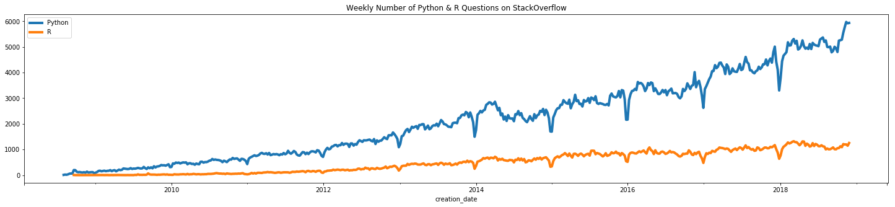

# Data Science Project with StackOverflow free dataset

This is my side project for exploring data and finding interesting problems in the StackOverflow dataset shared on Kaggle. 

## Getting Started

One would need to upload the Jupyter Notebooks to their Kaggle kernels. Kaggle also provides BigQuery functionality, so you can query large and interesting datasets such that one.


### Prerequisites

```
Kaggle account
```

## Tools which were used

* [BigQuery](https://cloud.google.com/bigquery/) - RESTful web service that enables interactive analysis of massively large datasets working in conjunction with Google Storage.
* [Pandas](https://pandas.pydata.org/) - Data Analytics

## Some plots from initial analysis


How fast number of questions for Python & R grew over the years?



